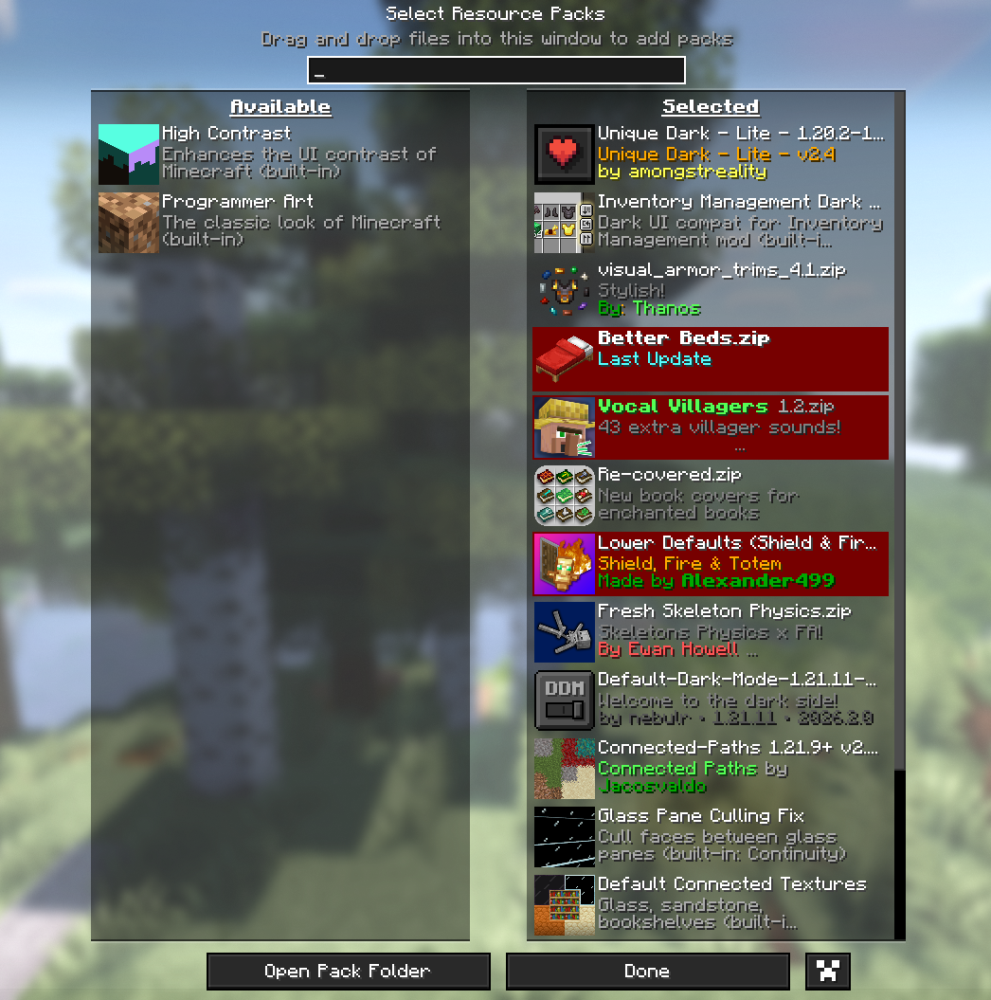

  

---

# 📜 A Treatise Most Arcane Concerning the Secret Realm of Frontverse

Heed well, O Tarnished one, who hath stumbled upon this sanctum of veiled configurations.

Within this repository lie the sacred and requisite arrangements, ordained by the keepers of the Frontverse, without which none may traverse nor partake in the hidden dominion of its clandestine Minecraft realm.

These are no mere trifles nor conveniences —  
but bindings of necessity, demanded of all who would set foot upon those lands unseen.

---

## 🜂 The Proper Ordering of the Resource Tomes

  

Let it be known:

The resource packs must be arranged in the selfsame order as is here depicted above.

For should their alignment be disturbed —  
or their ordained sequence sundered by careless hands —  
then shall the fabric of the realm grow unstable,  
and the world itself descend into discord and ruin most dire.

---

## ⚠️ A Solemn Warning Regarding the Coconut Relic

Under no hypothesis,  
beneath no circumstance,  
nor by any design of willful intent or misguided folly,

**must the sacred artifact known as `coconut.jpg` be removed from this repository.**

To expunge it is to invite calamity.  
To discard it is to beckon chaos.

Its presence, though inscrutable,  
is of utmost and immutable importance to the continued harmony of the domain.

---

Mayhap thou now understand the gravity of these bindings.

Proceed, then — if thou darest.
